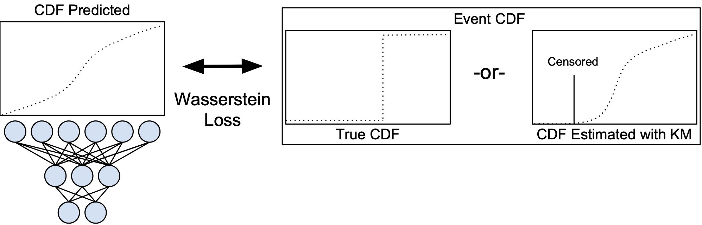
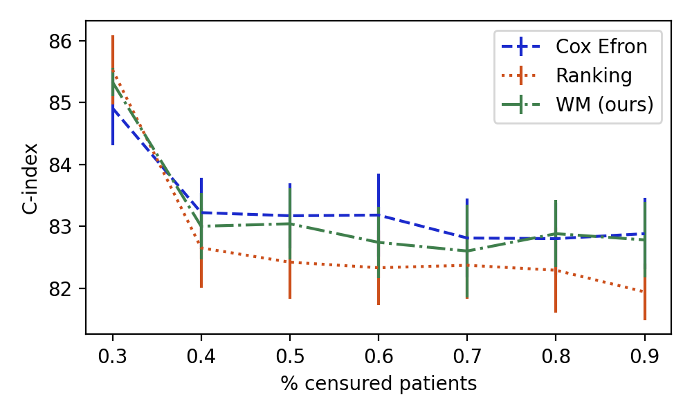

# Learning to rank for censored survival data

Margaux Luck*, Tristan Sylvain*, Joseph Paul Cohen, Heloise Cardinal, Andrea Lodi, Yoshua Bengio

\* equal contribution

This repository contains the code that allows to run the experiments presented in the paper:
- [Learning to rank for censored survival data](https://arxiv.org/abs/1806.01984)

Additional experiments and visualizations are presented in this paper:
- [Exploring the Wasserstein metric for survival analysis](http://proceedings.mlr.press/v146/sylvain21a/sylvain21a.pdf)

## Overview

Survival analysis is a type of semi-supervised ranking task where the target output (the survival time) is often right-censored. Utilizing this information is a challenge because it is not obvious how to correctly incorporate these censored examples into a model. We study how three categories of loss functions, namely partial likelihood methods, rank methods, and our classification method based on a Wasserstein metric (WM) and the nonparametric Kaplan Meier estimate of the probability density to impute the labels of censored examples, can take advantage of this information. The proposed method allows us to have a model that predict the probability distribution of an event. If a clinician had access to the detailed probability of an event over time this would help in treatment planning. For example, determining if the risk of kidney graft rejection is constant or peaked after some time. In addition, we demonstrate that under some conditions related to the choice of metric space this approach directly optimizes the expected C-index which is the most common evaluation metric for ranking survival models.

An overview of the proposed distribution matching loss. In the case that a sample is censored the KM estimate is used to impute the probability that should be assigned for that event.

| Datasets | Nb. samples | Nb. (%) censored | Nb. (%) unique times | Nb. features |
|----------|-------------|------------------|----------------------|--------------|
| SUPPORT2 | 9105        | 2904 (32.2)      | 1724 (19.1)          | 98           |
| AIDS3    | 3985        | 2223 (55.8)      | 1506 (37.8)          | 19           |
| COLON    | 929         | 477 (51.3)       | 780 (84.0)           | 48           |

Characteristics of the datasets used in our evaluation. The datasets have different numbers of samples, percentage of censored, and tied patients. The features are typically continuous or discrete clinical attributes.

| Loss Type          | Variant     | SUPPORT2         | AIDS3            | COLON            |
|--------------------|-------------|------------------|------------------|------------------|
| Partial likelihood | Cox         | 84.90+/-0.63     | 54.84+/-0.82     | **64.66+/-0.44** |
| Partial likelihood | Cox Efron's | 84.91+/-0.60     | 54.03+/-1.21     | 63.08+/-0.93     |
| Ranking            | sigm(z)     | **85.53+/-0.56** | 55.35+/-1.19     | 64.22+/-0.61     |
| Ranking            | Log-sigmoid | 85.44+/-0.57     | 55.28+/-1.29     | 63.36+/-0.52     |
| Ranking            | (z - 1)_+   | 84.96+/-0.56     | 55.41+/-1.20     | 63.98+/-1.12     |
| Ranking            | 1 - exp(-z) | 85.35+/-0.58     | 55.73+/-0.93     | 61.96+/-0.91     |
| Classification     | WM (ours)   | 85.33+/-0.52     | **56.03+/-1.01** | 64.32+/-0.39     |

Performance scores of the different methods. The table reports the C-index mean +/- standard error over the 5 folds. For
each dataset, the best model in terms of mean score is highlighted in bold. We draw the readers' attention to the classification losses which are among the losses that give the best results.

| Method              | WM               | Ranking          | Cox              |
|---------------------|------------------|------------------|------------------|
| No censored data    | 83.31+/-0.51     | 83.40+/-0.52     | 82.34+/-0.49     |
| Death censored data | 82.34+/-0.58     | 81.97+/-0.67     | 80.67+/-0.55     |
| With censored data  | **85.33+/-0.52** | **85.53+/-0.56** | **84.91+/-0.60** |

We explore how the three categories of methods are impacted by adding censored data. The table reports the C-index mean +/- standard error over the 5 fold. For ”Death at censoring”, we set the death event as the censored time. It is clear that censored data contains information that we can use to make better predictions.

Here we study how the composition of censored and uncensored patients during training impacts the C-index mean +/-
standard error over the 5 fold in the SUPPORT2 dataset. The validation and test sets are fixed and the training set has censored patients introduced by marking patients as censored at random. The plot starts at 30% because the dataset has that many censored patients by default. We find that the WM classification loss is robust to the introduction of censored data.

## Environment
1. Download miniconda: `wget https://repo.anaconda.com/miniconda/Miniconda3-latest-Linux-x86_64.sh`
2. Install miniconda: `bash Miniconda3-latest-Linux-x86_64.sh`
3. To create the environment to run the model, simply do `conda env create -f <path to>/environment.yml`.

You can find the appropriate `environment.yml` [here](environment.yml).

## Run the code
To run the experiments run in the activated environment and from this folder:
`python launcher.py --cfg <dataset_name>/<config_name>.yml`

The `<dataset_name>` can be `aids3`, `colon_death` and `support2`.
The `<config_name>.yml` are  located in the `config` folder, are sorted by dataset and correspond to the different experiments presented in the "Learning to rank for censored survival data" paper.
